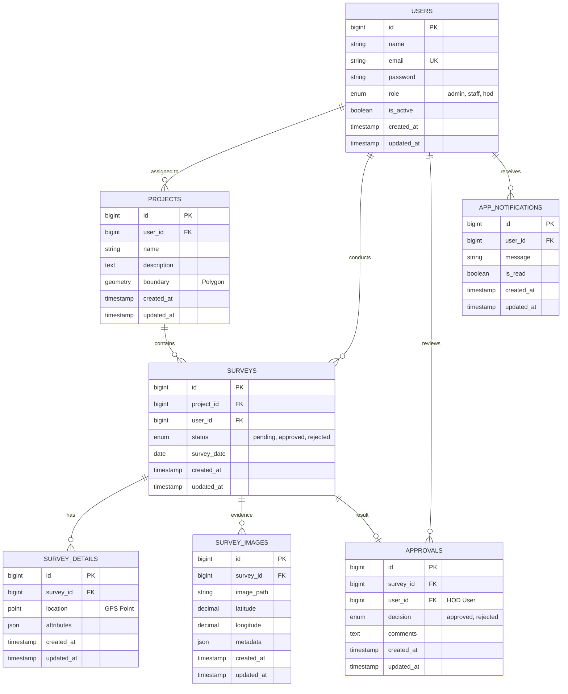

# GeoSurvey Database Documentation

## 5.2 Database Design: Entity Relationship Diagram (ERD)

## 5.3 Data Dictionary

### Table: `users`
| Field | Type | Nullable | Default | Description |
| :--- | :--- | :--- | :--- | :--- |
| `id` | BIGINT UNSIGNED | No | AUTO_INCREMENT | Primary Key |
| `name` | VARCHAR(255) | No | - | Full name of the user |
| `email` | VARCHAR(255) | No | - | Unique email for login |
| `password` | VARCHAR(255) | No | - | BCrypt hashed password |
| `role` | ENUM | No | 'staff' | User role: 'admin', 'staff', 'hod' |
| `is_active` | BOOLEAN | No | TRUE | Account status (Active/Inactive) |
| `remember_token` | VARCHAR(100) | Yes | NULL | Token for "remember me" session |
| `created_at` | TIMESTAMP | Yes | NULL | Record creation timestamp |
| `updated_at` | TIMESTAMP | Yes | NULL | Record last update timestamp |

### Table: `projects`
| Field | Type | Nullable | Default | Description |
| :--- | :--- | :--- | :--- | :--- |
| `id` | BIGINT UNSIGNED | No | AUTO_INCREMENT | Primary Key |
| `user_id` | BIGINT UNSIGNED | Yes | NULL | Foreign Key to `users.id` (Assignee) |
| `name` | VARCHAR(255) | No | - | Project name |
| `description` | TEXT | Yes | NULL | Project background/info |
| `boundary` | GEOMETRY | Yes | NULL | Spatial Polygon defining the project area |
| `created_at` | TIMESTAMP | Yes | NULL | Record creation timestamp |
| `updated_at` | TIMESTAMP | Yes | NULL | Record last update timestamp |

### Table: `surveys`
| Field | Type | Nullable | Default | Description |
| :--- | :--- | :--- | :--- | :--- |
| `id` | BIGINT UNSIGNED | No | AUTO_INCREMENT | Primary Key |
| `project_id` | BIGINT UNSIGNED | No | - | Foreign Key to `projects.id` |
| `user_id` | BIGINT UNSIGNED | No | - | Foreign Key to `users.id` (Staff) |
| `status` | ENUM | No | 'pending' | Workflow status: 'pending', 'approved', 'rejected' |
| `survey_date` | DATE | No | - | Date the survey was conducted |
| `created_at` | TIMESTAMP | Yes | NULL | Record creation timestamp |
| `updated_at` | TIMESTAMP | Yes | NULL | Record last update timestamp |

### Table: `survey_details`
| Field | Type | Nullable | Default | Description |
| :--- | :--- | :--- | :--- | :--- |
| `id` | BIGINT UNSIGNED | No | AUTO_INCREMENT | Primary Key |
| `survey_id` | BIGINT UNSIGNED | No | - | Foreign Key to `surveys.id` |
| `location` | POINT | No | - | GPS Point (X, Y) of the survey marker |
| `attributes` | JSON | Yes | NULL | Dynamic key-value pairs for survey data |
| `created_at` | TIMESTAMP | Yes | NULL | Record creation timestamp |
| `updated_at` | TIMESTAMP | Yes | NULL | Record last update timestamp |

### Table: `survey_images`
| Field | Type | Nullable | Default | Description |
| :--- | :--- | :--- | :--- | :--- |
| `id` | BIGINT UNSIGNED | No | AUTO_INCREMENT | Primary Key |
| `survey_id` | BIGINT UNSIGNED | No | - | Foreign Key to `surveys.id` |
| `image_path` | VARCHAR(255) | No | - | Path to the stored evidence image |
| `latitude` | DECIMAL(10,8) | No | - | Captured GPS Latitude |
| `longitude` | DECIMAL(11,8) | No | - | Captured GPS Longitude |
| `metadata` | JSON | Yes | NULL | EXIF data or other image info |
| `created_at` | TIMESTAMP | Yes | NULL | Record creation timestamp |
| `updated_at` | TIMESTAMP | Yes | NULL | Record last update timestamp |

### Table: `approvals`
| Field | Type | Nullable | Default | Description |
| :--- | :--- | :--- | :--- | :--- |
| `id` | BIGINT UNSIGNED | No | AUTO_INCREMENT | Primary Key |
| `survey_id` | BIGINT UNSIGNED | No | - | Foreign Key to `surveys.id` |
| `user_id` | BIGINT UNSIGNED | No | - | Foreign Key to `users.id` (HOD review) |
| `decision` | ENUM | No | - | Final decision: 'approved', 'rejected' |
| `comments` | TEXT | Yes | NULL | HOD feedback or rejection reasons |
| `created_at` | TIMESTAMP | Yes | NULL | Record creation timestamp |
| `updated_at` | TIMESTAMP | Yes | NULL | Record last update timestamp |

### Table: `app_notifications`
| Field | Type | Nullable | Default | Description |
| :--- | :--- | :--- | :--- | :--- |
| `id` | BIGINT UNSIGNED | No | AUTO_INCREMENT | Primary Key |
| `user_id` | BIGINT UNSIGNED | No | - | Foreign Key to `users.id` (Recipient) |
| `message` | VARCHAR(255) | No | - | Notification content |
| `is_read` | BOOLEAN | No | FALSE | Read status of the notification |
| `created_at` | TIMESTAMP | Yes | NULL | Record creation timestamp |
| `updated_at` | TIMESTAMP | Yes | NULL | Record last update timestamp |
